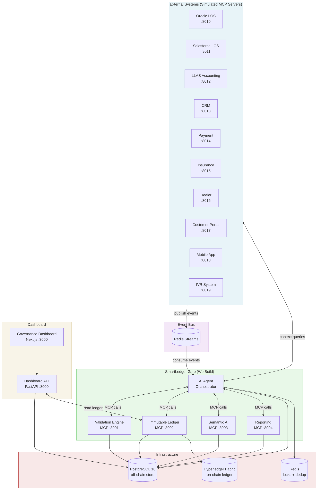
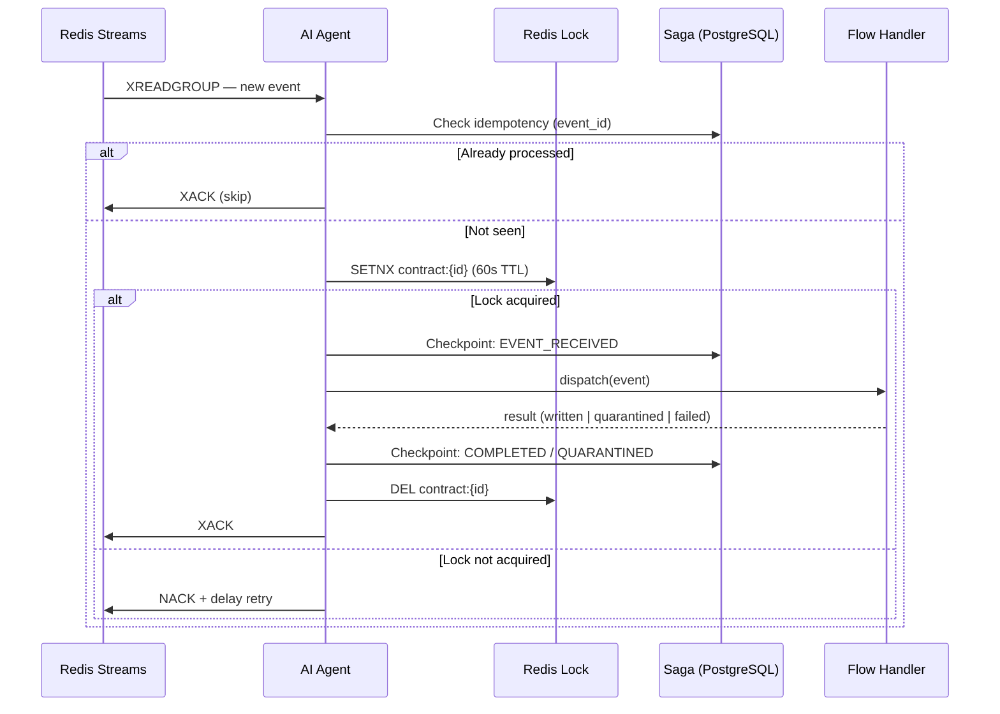
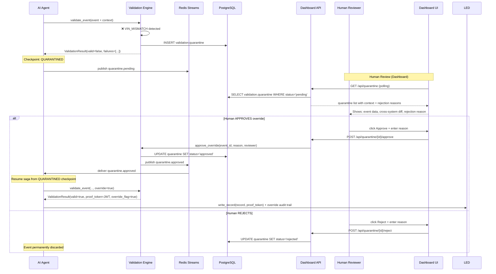
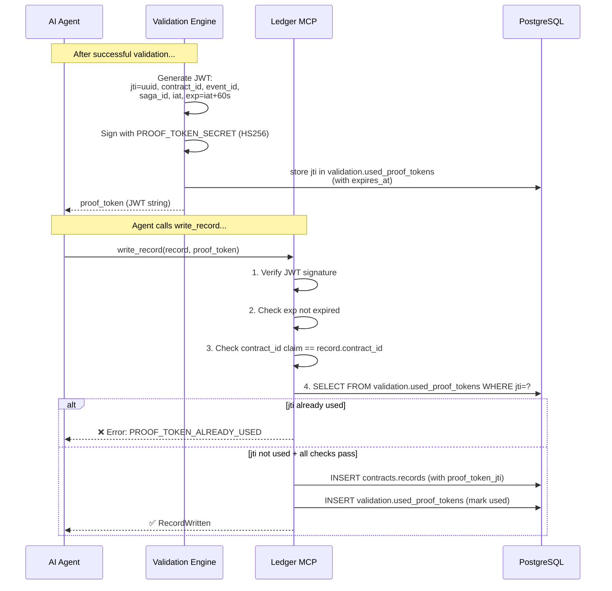
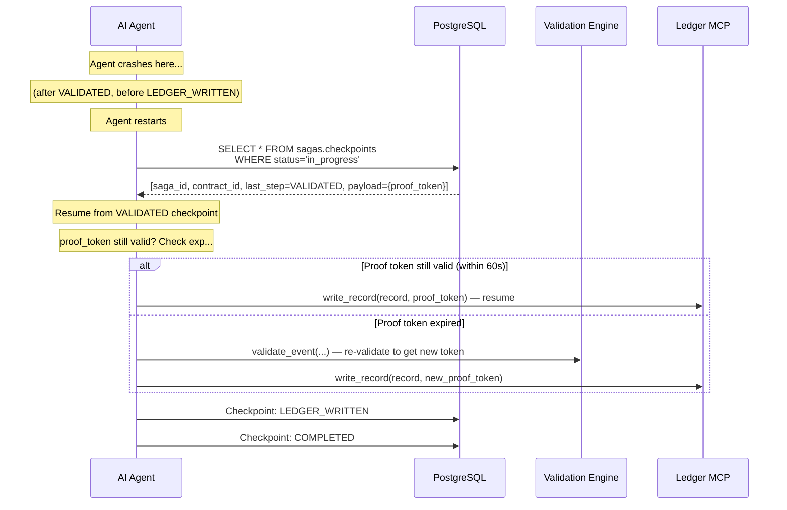
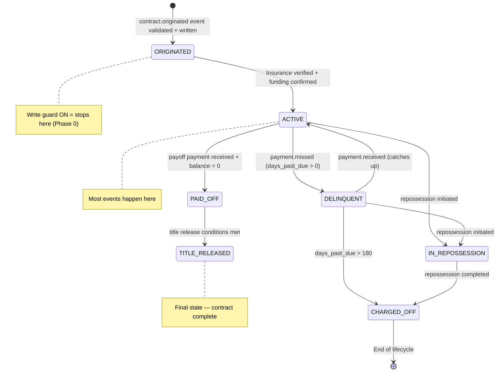
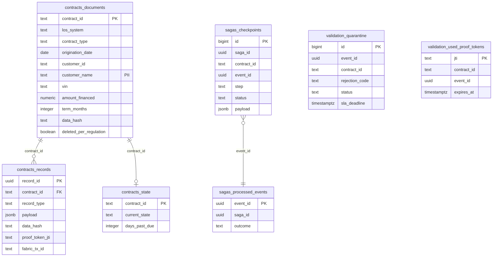

# SmartLedger — Architecture

---

## 1. System Overview

---

## 2. Agent Event Loop

---

## 3. Contract Origination — Happy Path

---

## 4. Contract Origination — Unhappy Path (Quarantine + Override)

---

## 5. Validation Proof Token Flow

---

## 6. Saga Crash Recovery

---

## 7. Contract State Machine

---

## 8. PostgreSQL Schema Layout

---

## 9. MCP Server Port Map

| Service | Port | Type |
|---|---|---|
| Dashboard API | 8000 | REST (FastAPI) |
| Validation Engine MCP | 8001 | MCP (streamable-http) |
| Immutable Ledger MCP | 8002 | MCP (streamable-http) |
| Semantic AI MCP | 8003 | MCP (streamable-http) |
| Reporting MCP | 8004 | MCP (streamable-http) |
| Oracle LOS (sim) | 8010 | MCP (streamable-http) |
| Salesforce LOS (sim) | 8011 | MCP (streamable-http) |
| LLAS (sim) | 8012 | MCP (streamable-http) |
| CRM (sim) | 8013 | MCP (streamable-http) |
| Payment (sim) | 8014 | MCP (streamable-http) |
| Insurance (sim) | 8015 | MCP (streamable-http) |
| Dealer (sim) | 8016 | MCP (streamable-http) |
| Customer Portal (sim) | 8017 | MCP (streamable-http) |
| Mobile App (sim) | 8018 | MCP (streamable-http) |
| IVR (sim) | 8019 | MCP (streamable-http) |
| Dashboard UI | 3000 | Next.js |
| PostgreSQL | 5432 | Database |
| Redis | 6379 | Cache + Streams |
