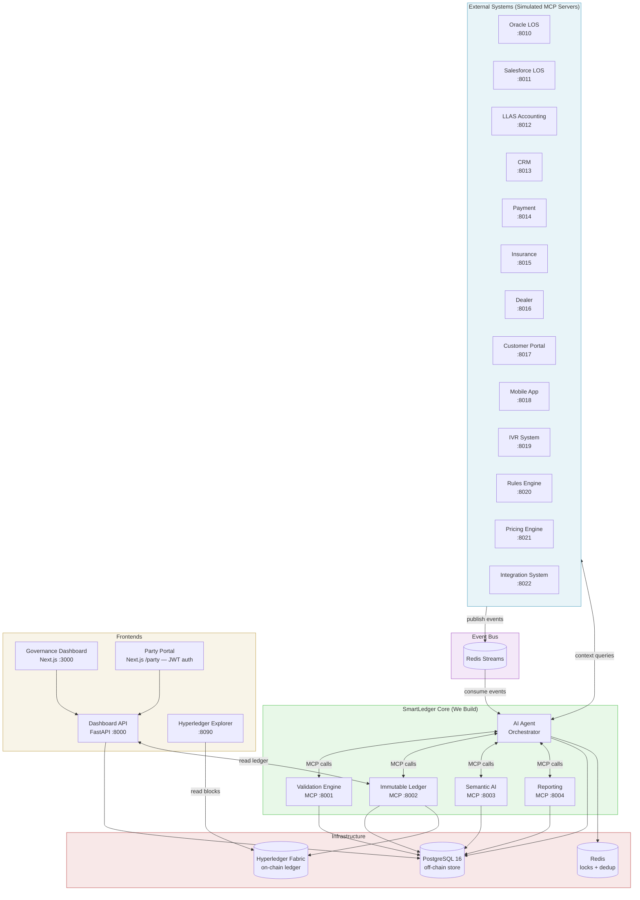
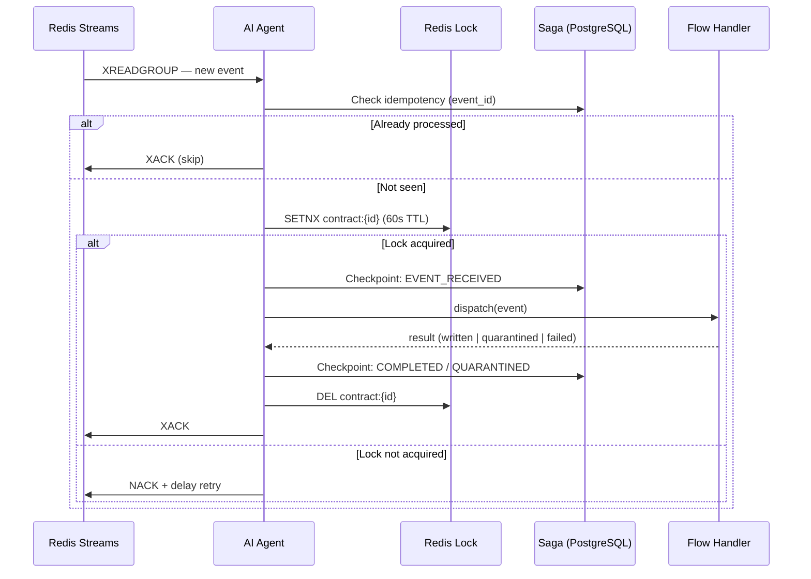
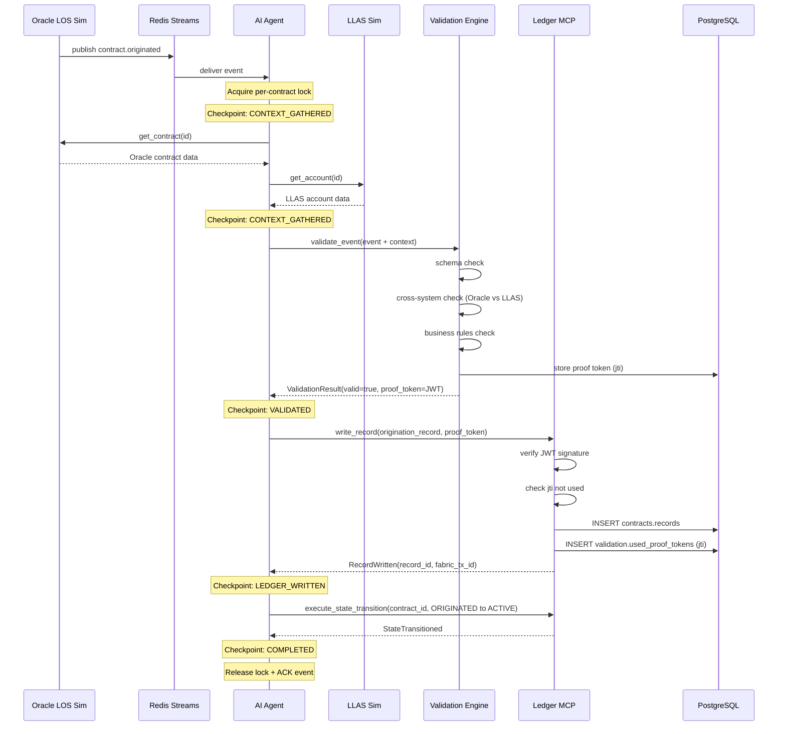
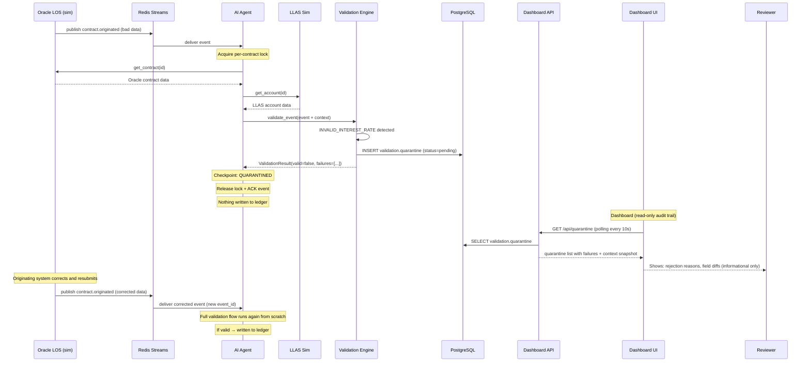
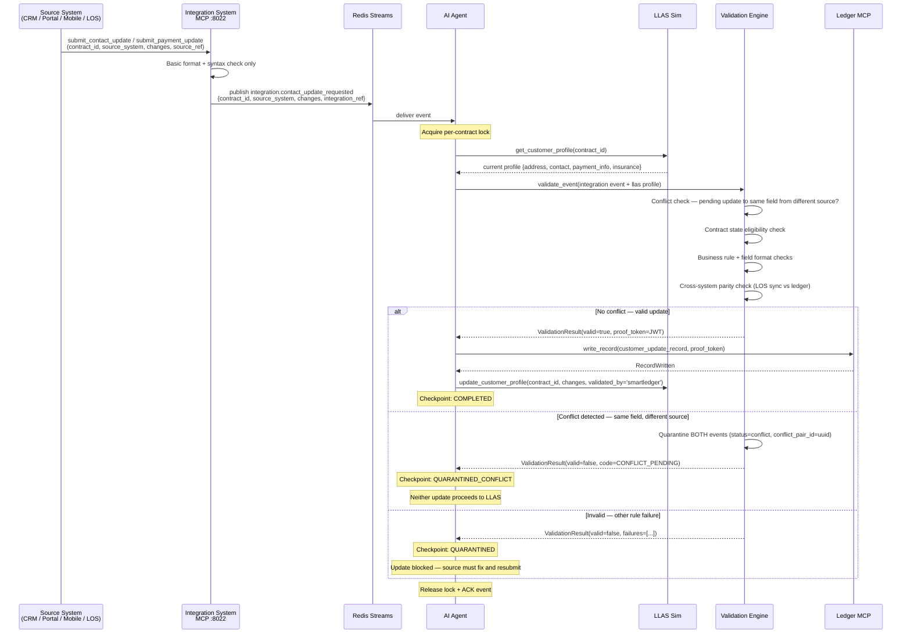
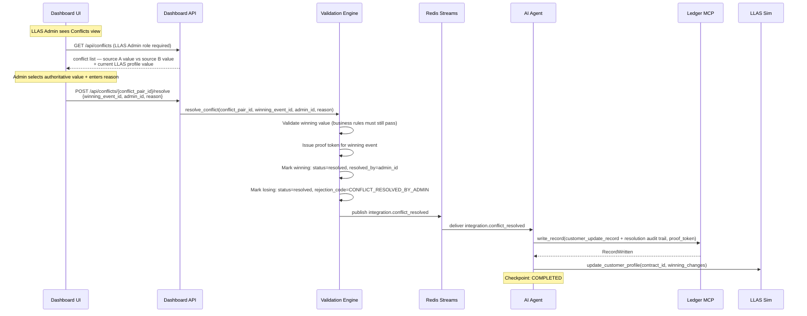
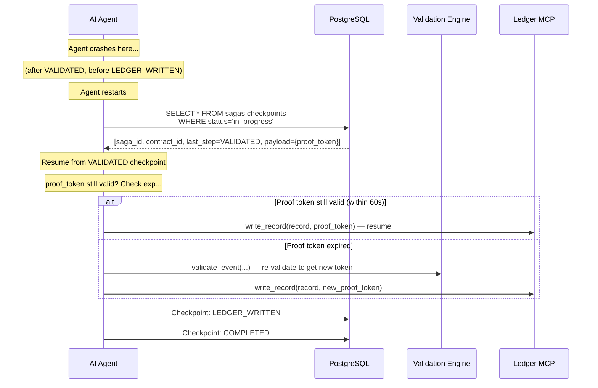
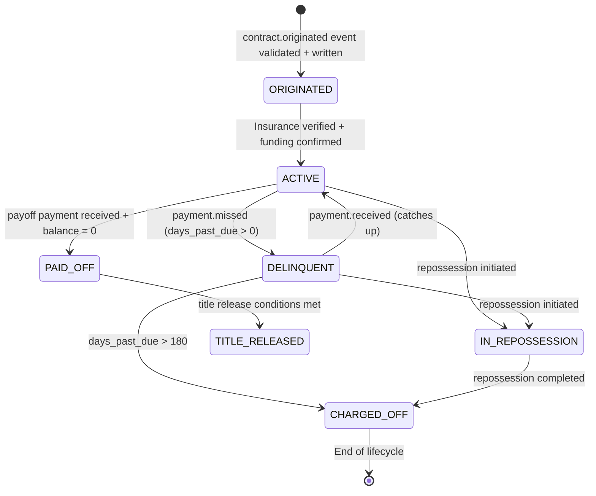
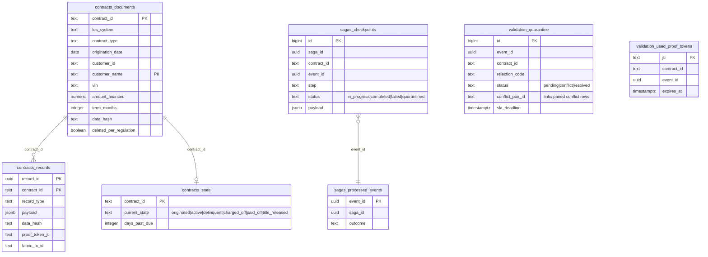

# SmartLedger — Architecture

---

## 1. System Overview

**Frontend split (Phase I):**
- **Governance Dashboard (`:3000`)** — internal ops (admin, auditor, operator, compliance). Uses `X-SmartLedger-Identity` header.
- **Party Portal (`:3000/party`)** — external parties (borrower, lender, lessee, lessor). Uses Bearer JWT issued by `POST /api/party/auth`. Smart Data Gateway enforces party-based access at the API layer (`SDG Path A`).
- **Hyperledger Explorer (`:8090`)** — independent visual verification of every `tx_id`. Connects to the Fabric peer with the org Admin MSP identity; serves the same data parties see in the Party Portal but read directly from the chain.

> For the Fabric runtime configuration (state DB, orderer type, channel
> name, MSP IDs, capabilities, ports, change procedures, production-
> readiness gaps), see [`FABRIC_CONFIG.md`](FABRIC_CONFIG.md).

---

## 2. Agent Event Loop

---

## 3. Contract Origination — Happy Path

---

## 4. Contract Origination — Unhappy Path (Quarantine + Read-Only Audit Trail)

> **SDG Validate-Only Boundary:** SmartLedger does NOT own the data and does NOT approve, override, or correct it. The originating system (Oracle LOS / Salesforce LOS) must fix the data and resend. The quarantine is a **read-only audit trail** — not an approval queue.

## 4b. Customer Profile Update Flow (Integration Layer)

> Source systems (CRM, Portal, Mobile, LOS) call the Integration System when pushing customer data changes to LLAS. SmartLedger intercepts at this boundary to validate and audit every critical change.

---

## 4c. Conflict Resolution Flow (LLAS Admin)

> When two source systems submit competing updates to the same field, both are blocked. The LLAS Admin — as the system-of-record owner — adjudicates which value is authoritative. SmartLedger still validates the selected value before writing.

---

## 5. Validation Proof Token Flow

---

## 6. Saga Crash Recovery

---

## 7. Contract State Machine

---

## 8. PostgreSQL Schema Layout

---

## 9. Status & State Reference

> Authoritative enum values used across database, APIs, and the Governance Dashboard. See REQUIREMENTS.md §7.6 for full definitions.

### Quarantine Status (`validation.quarantine.status`)

| Value      | Set by             | Meaning |
|------------|--------------------|---------|
| `pending`  | Validation Engine  | Failed validation — data quality, business rule, or state eligibility. Originating system must correct and resubmit. |
| `conflict` | Validation Engine  | Two sources submitted competing updates to the same field. Both quarantined as a matched pair via `conflict_pair_id`. Awaiting LLAS Admin resolution. |
| `resolved` | Validation Engine  | Closed. Both sides of a conflict pair move to `resolved` after admin adjudication — winning side applied, losing side records `CONFLICT_RESOLVED_BY_ADMIN`. |

**No `approved` or `override` status exists.** SmartLedger never grants exceptions.

### Contract State (`contracts.state.current_state`)

| Value            | Meaning |
|------------------|---------|
| `originated`     | Received, validated, ledger written. Pre-activation. |
| `active`         | In good standing. Default for LLAS-seeded contracts with no state row. |
| `delinquent`     | Past due. |
| `charged_off`    | Written off as loss. No further updates permitted. |
| `paid_off`       | Fully paid. Awaiting title release. |
| `title_released` | Title transferred. Lifecycle complete. |

### Integration Submission Status

| Value        | Meaning |
|--------------|---------|
| `pending`    | Submitted to Integration System. Event published to Redis. |
| `validated`  | SmartLedger validated. Ledger written. LLAS updated. |
| `quarantined`| Rejected by SmartLedger. Originating system must correct and resubmit. |
| `conflict`   | Competing update detected. Both quarantined pending LLAS Admin resolution. |

---

## 10. MCP Server Port Map

| Service | Port | Type |
|---|---|---|
| Dashboard API | 8000 | REST (FastAPI) |
| Validation Engine MCP | 8001 | MCP (streamable-http) |
| Immutable Ledger MCP | 8002 | MCP (streamable-http) |
| Semantic AI MCP | 8003 | MCP (streamable-http) |
| Reporting MCP | 8004 | MCP (streamable-http) |
| Oracle LOS (sim) | 8010 | MCP (streamable-http) |
| Salesforce LOS (sim) | 8011 | MCP (streamable-http) |
| LLAS (sim) | 8012 | MCP (streamable-http) |
| CRM (sim) | 8013 | MCP (streamable-http) |
| Payment (sim) | 8014 | MCP (streamable-http) |
| Insurance (sim) | 8015 | MCP (streamable-http) |
| Dealer (sim) | 8016 | MCP (streamable-http) |
| Customer Portal (sim) | 8017 | MCP (streamable-http) |
| Mobile App (sim) | 8018 | MCP (streamable-http) |
| IVR (sim) | 8019 | MCP (streamable-http) |
| Rules Engine (sim) | 8020 | MCP (streamable-http) |
| Pricing Engine (sim) | 8021 | MCP (streamable-http) |
| Integration System (sim) | 8022 | MCP (streamable-http) |
| Dashboard UI | 3000 | Next.js |
| Party Portal | 3000 (route `/party`) | Next.js — Bearer JWT |
| Hyperledger Explorer | 8090 | Web UI — visual chain browser |
| PostgreSQL | 5432 | Database |
| Redis | 6379 | Cache + Streams |
